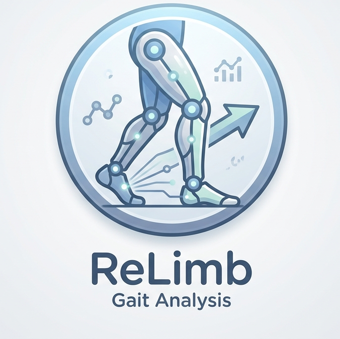

# ReLimb

## 🚀 Main Solution

ReLimb is a gait‑analysis system that helps people with leg prosthetics understand how they are walking and what to do next. It turns a short walking video into a clear, empathetic summary that explains the detected gait issue and suggests safe next steps.

## 🎯 Project Goal

Build a practical tool for prosthetic users who are still adapting to their first limb. The long‑term vision is a mobile app that helps them feel confident, track progress, and share insights with clinicians.

## ✅ What We Implemented So Far

### Data + Preprocessing
- Extract raw keypoints from **XML annotations** when available; otherwise from video.
- Normalize and smooth keypoints to reduce noise and stabilize gait signals.
- Crop and clip videos into smaller samples to expand the dataset.

### Models & Training
- LSTM and ST‑GCN models for gait classification.
- Training done on Vertex AI with data stored in Google Cloud Storage buckets.
- Benchmarking runs to compare models and select the best performer.
- Current best model: **ST‑GCN**, using a graph of joint relationships.

### Inference + App
- FastAPI + Celery pipeline that predicts a label and generates an LLM explanation.
- Streamlit UI for uploading a video and reading the response.

## 🧠 What ReLimb Solves

**Problem:** New prosthetic users often feel uncertain about their gait and don’t know whether their walk looks normal or needs correction. Clinical feedback is limited and slow.

**Solution:** ReLimb provides a clear, non‑alarming interpretation of gait patterns, so users can feel more confident and know when to seek help.

## 🛠️ Current Capabilities (Summary)

- Pose extraction and gait event detection
- Normalization and smoothing
- Video clipping and dataset preparation
- ST‑GCN and LSTM training + benchmarking
- Best‑model selection (ST‑GCN)
- LLM‑based patient‑friendly summary

## � Future Roadmap (TODO)

1) **Biomechanical Metrics + Two‑Head Architecture**  
   Feed MLP with biomechanical metrics (the “mathematician”) alongside ST‑GCN (the “viewer”).

2) **Skin Irritation Detection**  
   Detect redness or irritation near prosthetic contact areas.

3) **Progress Tracker**  
   Track walking improvement over time.

4) **Mobile App**  
   Ship a full mobile experience with on‑device upload and feedback.

5) **Clinical Collaboration**  
   Enable doctors to monitor progress and provide guidance inside the app.

## 🧪 Running the Project (Quick Start)

```powershell
pip install -r .\requirements.txt
py -m scripts.run_worker
py -m scripts.run_api
streamlit run .\src\ui\app.py
```

On Windows, the worker uses the `solo` pool to avoid `WinError 5` permission issues (already configured in the script).

Run the API:

```powershell
python scripts/run_api.py
```

Example request (blocking until response):

```powershell
Invoke-RestMethod -Uri http://127.0.0.1:8000/predict -Method Post -Form @{video=Get-Item .\data\incoming\video1.mp4}
```

### Streamlit UI

Launch the UI after the API and worker are running:

```powershell
streamlit run src/ui/app.py
```

The UI uploads a video to the `/predict` endpoint and displays the LLM summary.

Optional: Enter a message in your language so the LLM responds in the same language.

Response:

- `label`
- `summary`
- `score` (if available)

Environment variables:

- `RELIMB_REDIS_URL` (default: `redis://localhost:6379/0`)
- `RELIMB_CELERY_BACKEND` (default: same as broker)
- `RELIMB_TASK_TIMEOUT_S` (default: `600`)
- `RELIMB_FIXED_LABEL` (optional: override label for testing)
- `GROQ_API_KEY` (required for LLM responses)
- `RELIMB_GROQ_MODEL` (default: `meta-llama/llama-4-scout-17b-16e-instruct`)
- `RELIMB_INCOMING_DIR`, `RELIMB_RESULTS_DIR` (optional override paths)
- `RELIMB_API_HOST`, `RELIMB_API_PORT`

### Single-Video Pipeline (Incoming → Results)

Place a new video inside `data/incoming/` (or pass any path), then run the single-video pipeline to write outputs in `data/results/<video_id>/`.

```bash
python src/pose_extraction/single_video_pipeline.py data/incoming/walk_001.mp4
```

Outputs:

- `data/results/walk_001/keypoints.npy`
- `data/results/walk_001/keypoints_normalized.npy`
- `data/results/walk_001/detected_events.csv`
- `data/results/walk_001/prediction.json` (label + template-based summary)

LLM prompts are built from the predicted label and any available metadata notes found next to the video (e.g., JSON files created by `build_dataset_index.py`).

### 0. Isolate Prosthetic Limb User (for Multi-Person Videos)

If your videos contain multiple people (doctors, other patients), first isolate the person with the prosthetic limb:

```bash
# Automatic processing of entire dataset
python src/pose_extraction/batch_crop_videos.py

# Process single video
python src/pose_extraction/video_cropper.py input.mp4 output.mp4

# Interactive selection (for manual control)
python src/pose_extraction/interactive_selector.py input.mp4 output.mp4
```

**Output:** Cropped videos in `data/raw_videos/hf_cropped/` (preserves folder structure)

📖 **See detailed guide:** `src/pose_extraction/README_VIDEO_CROPPING.md`

### 1. Process Videos for Gait Analysis

```bash
# Place videos in data/raw_videos/ (or use cropped videos)
# Run the gait algorithm
python src/pose_extraction/gait_algorithm.py
```

This will:
- Process all videos in `data/raw_videos/`
- Extract pose landmarks frame-by-frame
- Detect heel strikes and toe-offs
- Save events to `data/sessions/<session_id>/detected_events.csv`

### 2. Extract Gait Features

```bash
# Compute asymmetry metrics
python src/pose_extraction/limb_detection.py
```

This will:
- Load detected events from all sessions
- Calculate stride, stance, and swing times for both legs
- Compute asymmetry percentages
- Save results to `src/features/feature_events.xlsx`


## Algorithm Details

### Gait Event Detection Pipeline

1. **Pose Extraction**: MediaPipe detects 33 body landmarks per frame
2. **Signal Construction**: Horizontal distance (hip_x - foot_x) for each leg
3. **Preprocessing**:
   - NaN interpolation for missing frames
   - Median detrending
   - Butterworth low-pass filter (10th order, Wn=0.1752)
4. **Peak Detection**:
   - Peaks = Heel strikes (foot forward relative to hip)
   - Troughs = Toe-offs (foot behind hip)
   - Minimum separation: 0.8 seconds (prevents double-detection)

### Asymmetry Calculation

```
Asymmetry (%) = |left - right| / ((left + right) / 2) × 100
```

Applied to:
- **Stride Time**: Heel strike to next heel strike (same foot)
- **Stance Time**: Heel strike to toe-off (weight-bearing phase)
- **Swing Time**: Toe-off to next heel strike (swing phase)

## ProGait Dataset

The project integrates with the ProGait dataset (ICCV'25), which provides:
- 412 annotated video clips
- 4 transfemoral amputees
- Multiple prosthesis configurations
- 3 task types: Video Object Segmentation, 2D Pose Estimation, Gait Analysis

**Citation**:
```
ProGait: A Multi-Purpose Video Dataset and Benchmark for Transfemoral Prosthesis Users
https://arxiv.org/abs/2507.10223
```

## Output Format

### detected_events.csv
```csv
side,event,frame,time_s
left,heel_strike,6,0.24
left,toe_off,17,0.68
right,heel_strike,21,0.84
...
```

### feature_events.xlsx
```
session_id | Left stride mean | Right stride mean | Asymmetry (stride)% | ...
20251109_193053_01_left_right | 1.251 | 1.246 | 0.458 | ...
```

## Future Enhancements

- [ ] Machine learning models for gait classification (`src/ml/`)
- [ ] Advanced signal processing techniques (`src/signal_processing/`)
- [ ] Mobile app integration (`src/mobile_integration/`)
- [ ] Real-time video streaming analysis
- [ ] 3D pose estimation and depth integration
- [ ] Automated clinical report generation
- [ ] Multi-person tracking support

## Technologies Used

- **Computer Vision**: OpenCV, MediaPipe
- **Pose Estimation**: cvzone PoseModule (wrapper for MediaPipe)
- **Signal Processing**: SciPy (Butterworth filter, peak detection)
- **Data Processing**: NumPy, Pandas
- **Dataset**: Hugging Face Datasets (ProGait)

## License

This project uses the ProGait dataset which is licensed under CC-BY-NC-SA-4.0.

## Contributors

- **Repository Owner**: saifallah1234
- **ProGait Dataset**: ericyxy98 (Hugging Face)

## References

1. ProGait Dataset: https://huggingface.co/datasets/ericyxy98/ProGait
2. MediaPipe Pose: https://google.github.io/mediapipe/solutions/pose
3. COCO-WholeBody keypoint format: https://github.com/jin-s13/COCO-WholeBody

---

For questions or contributions, please open an issue on GitHub.

